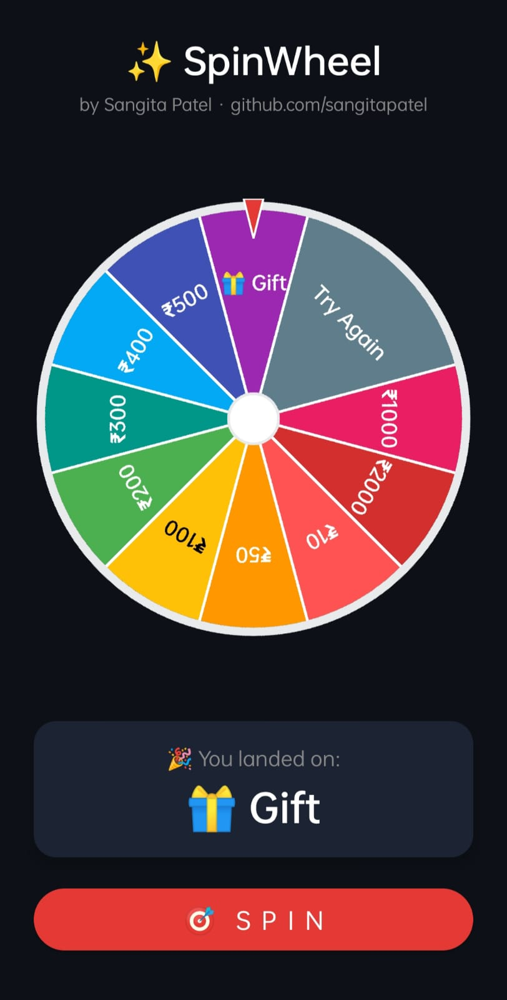

<div align="center">

# 🎡 kotlin-spin-wheel

**Android Lucky Wheel · Prize Wheel · Fortune Wheel — Kotlin Custom View Library**


[](https://jitpack.io/#sangitapatel/kotlin-spin-wheel)
[](https://android-arsenal.com/api?level=21)
[](LICENSE)
[](https://kotlinlang.org)
[](https://github.com/sangitapatel)

A fully custom, zero-dependency **Android Spin Wheel** library built entirely by [Sangita Patel](https://github.com/sangitapatel).
Weighted slices · Guaranteed winner · Bounce animation · 60 fps · API 21+



</div>

---

## ✨ Features

| Feature | Details |
|---|---|
| 🎨 Custom slices | Any number of slices (min 2), any color, emoji labels |
| ⚖️ Weighted slices | `weight=2f` = twice the chance of winning |
| 🎯 Guaranteed winner | `spin(targetIndex)` — server-controlled result |
| 👆 Tap-to-spin | Single tap on wheel triggers spin |
| 🏀 Bounce overshoot | Natural coin-spin feel at landing |
| 📈 Custom interpolator | `DeceleratingSpinInterpolator` — cubic ease-out |
| 🖼️ Bitmap cache | Smooth 60 fps, off-screen rendering |
| 📍 Pointer / needle | Top or bottom, fully customisable color and size |
| ⭕ Hub circle | Toggle on/off, custom color and size |
| 🔲 Border + divider | Configurable width and color |
| 📣 Spin callbacks | `onSpinStart` / `onSpinEnd(slice, index)` |
| 🎮 Programmatic control | `spin()`, `stopNow()`, `resetAngle()` |
| 📱 API 21+ | Works on all modern Android devices |
| 🚫 Zero dependencies | No Glide, no RxJava — nothing that conflicts with your dependency tree |

---

## 🚀 Installation

### Step 1 — Add JitPack repository

**`settings.gradle.kts`** (Gradle 7+):
```kotlin
dependencyResolutionManagement {
    repositories {
        google()
        mavenCentral()
        maven { url = uri("https://jitpack.io") }  // ← add this
    }
}
```

<details>
<summary>📄 Using older Groovy DSL? Click here</summary>

In your **project-level** `build.gradle`:
```groovy
allprojects {
    repositories {
        google()
        mavenCentral()
        maven { url 'https://jitpack.io' }  // ← add this
    }
}
```
</details>

### Step 2 — Add dependency

**`build.gradle.kts`** (app module):
```kotlin
dependencies {
    implementation("com.github.sangitapatel:kotlin-spin-wheel:1.0.0")
}
```

---

## ⚡ Quick Start

### 1. Add to XML layout

```xml
<com.sangitapatel.spinwheel.SpinWheelView
    android:id="@+id/spinWheel"
    android:layout_width="300dp"
    android:layout_height="300dp"
    app:swv_pointerColor="#E53935"
    app:swv_borderColor="#37474F"
    app:swv_borderWidth="6dp"
    app:swv_dividerColor="#FFFFFF"
    app:swv_dividerWidth="2dp"
    app:swv_labelTextSize="13sp"
    app:swv_tapToSpin="true"
    app:swv_bounceEnabled="true"
    app:swv_showHub="true"
    app:swv_hubColor="#FFFFFF"
    app:swv_hubRadiusFraction="0.12"
    app:swv_minSpinDuration="3000"
    app:swv_maxSpinDuration="6000"/>
```

> **Note:** `SpinWheelView` is always square.
> Set `layout_width` = `layout_height`, or use `app:layout_constraintDimensionRatio="1:1"`.

### 2. Set slices in Kotlin

```kotlin
val wheel = findViewById<SpinWheelView>(R.id.spinWheel)

wheel.slices = listOf(
    WheelSlice("₹100",      Color.parseColor("#E53935"), weight = 1f, tag = 100),
    WheelSlice("Try Again", Color.parseColor("#607D8B"), weight = 3f, tag = 0),
    WheelSlice("₹500",      Color.parseColor("#43A047"), weight = 1f, tag = 500),
    WheelSlice("🎁 Gift",   Color.parseColor("#8E24AA"), weight = 1f, tag = -1),
    WheelSlice("₹1000",     Color.parseColor("#E91E63"), weight = 1f, tag = 1000),
    WheelSlice("₹2000",     Color.parseColor("#C62828"), weight = 1f, tag = 2000),
)
```

### 3. Listen for result

```kotlin
wheel.spinListener = object : SpinWheelView.OnSpinListener {
    override fun onSpinStart(view: SpinWheelView) {
        btnSpin.isEnabled = false
    }
    override fun onSpinEnd(view: SpinWheelView, slice: WheelSlice, index: Int) {
        btnSpin.isEnabled = true
        Toast.makeText(this@MainActivity,
            "You won: ${slice.label}", Toast.LENGTH_SHORT).show()
        // slice.tag  → your custom payload (Any?)
        // index      → 0-based position in slices list
    }
}

btnSpin.setOnClickListener { wheel.spin() }
```

---

## 🧩 WheelSlice Parameters

```kotlin
WheelSlice(
    label     = "₹500",                          // Slice text — emoji supported ✅
    fillColor = Color.parseColor("#43A047"),      // Slice background color
    textColor = Color.WHITE,                      // Label color (default = WHITE)
    weight    = 1f,                               // Relative win probability (positive Float)
    tag       = 500                               // Any? payload — returned in onSpinEnd
)
```

### Weighted Probability

```kotlin
// "Try Again" has 3× more chance than any prize slice
WheelSlice("₹1000",     color, weight = 1f)
WheelSlice("Try Again", color, weight = 3f)
// Total weight = 4 → ₹1000 = 25% chance, Try Again = 75% chance
```

---

## 🎯 Guaranteed Winner (Server-controlled)

```kotlin
// Always land on index 2 — ideal for server-decided outcomes
wheel.spin(targetIndex = 2)

// Random winner based on weights (default behaviour)
wheel.spin()
wheel.spin(targetIndex = -1)  // same as above
```

---

## 🛡️ Edge Cases & Behaviour

| Situation | Behaviour |
|---|---|
| `slices` count < 2 | Throws `IllegalArgumentException` |
| `stopNow()` mid-spin | Hard stop · no `onSpinEnd` fired · `isCurrentlySpinning` = `false` · safe to call `spin()` again |
| `hubRadiusFraction` out of range | Auto-clamped to `0.05f – 0.40f` |
| `spin()` called while spinning | Ignored — waits for current spin to finish |

---

## 📐 XML Attributes Reference

| Attribute | Type | Default | Description |
|---|---|---|---|
| `swv_pointerColor` | color | `#E53935` | Pointer / needle color |
| `swv_dividerWidth` | dimension | `2dp` | Line between slices |
| `swv_dividerColor` | color | `#FFFFFF` | Divider line color |
| `swv_borderWidth` | dimension | `6dp` | Outer ring width |
| `swv_borderColor` | color | `#37474F` | Outer ring color |
| `swv_labelTextSize` | dimension | `14sp` | Slice label text size |
| `swv_labelTextColor` | color | `#FFFFFF` | Default label color |
| `swv_minSpinDuration` | integer (ms) | `3000` | Minimum spin duration |
| `swv_maxSpinDuration` | integer (ms) | `6000` | Maximum spin duration |
| `swv_tapToSpin` | boolean | `true` | Tap wheel to spin |
| `swv_bounceEnabled` | boolean | `true` | Bounce overshoot on landing |
| `swv_showHub` | boolean | `true` | Show center hub circle |
| `swv_hubColor` | color | `#FFFFFF` | Hub fill color |
| `swv_hubRadiusFraction` | float `0.05–0.40` | `0.12` | Hub size as fraction of wheel radius |

---

## 🔧 Full Public API

```kotlin
// ── Slices ─────────────────────────────────────────────────────
wheel.slices = listOf(...)          // min 2 — throws IllegalArgumentException if fewer

// ── Styling ────────────────────────────────────────────────────
wheel.pointerColor      = Color.RED
wheel.borderColor       = Color.DKGRAY
wheel.borderWidth       = 6f        // px
wheel.dividerColor      = Color.WHITE
wheel.dividerWidth      = 2f        // px
wheel.labelTextSize     = 14f       // sp converted to px
wheel.showHub           = true
wheel.hubColor          = Color.WHITE
wheel.hubRadiusFraction = 0.12f     // 0.05f – 0.40f

// ── Behaviour ──────────────────────────────────────────────────
wheel.tapToSpin       = true
wheel.bounceEnabled   = true
wheel.minSpinDuration = 3_000L      // ms
wheel.maxSpinDuration = 6_000L      // ms
wheel.spinListener    = myListener

// ── Control ────────────────────────────────────────────────────
wheel.spin()                        // random weighted spin
wheel.spin(targetIndex = 2)         // guaranteed winner at index 2
wheel.stopNow()                     // hard stop, no callback
wheel.resetAngle()                  // snap back to 0°

// ── State ──────────────────────────────────────────────────────
val isSpinning: Boolean = wheel.isCurrentlySpinning
```

---

## 🏷️ GitHub Topics

Add these to your repository for better discoverability *(Settings → Topics)*:

`android` `kotlin` `spin-wheel` `lucky-wheel` `prize-wheel` `fortune-wheel` `android-library` `custom-view` `jitpack` `android-spin-wheel` `kotlin-spin-wheel`

---

## 📄 License

```
MIT License — Copyright (c) 2026 Sangita Patel
https://github.com/sangitapatel
```

See [LICENSE](LICENSE) for full text.
